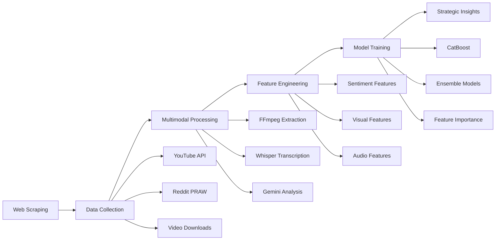

# Super Bowl Advertisement Analysis for Rogue Ridge

<p align="center">
  
  
  
</p>

## 🎯 Project Overview

This project delivers a comprehensive AI-powered analysis of 25 years of Super Bowl commercials to develop a data-driven advertising strategy for Forge & Field's new Rogue Ridge personal care product line. Using multimodal machine learning techniques, we analyzed 1,205 Super Bowl advertisements to identify critical success factors and provide strategic recommendations for a high-impact 30-second commercial.

### 📊 Key Achievements

- **Data Volume**: 1,205(1,185) Super Bowl ads analyzed (2000-2025)
- **Model Performance**: 92.7% accuracy with CatBoost algorithm
- **Business Impact**: Strategic guidance for $11M advertising investment
- **Technical Innovation**: Multimodal analysis combining video, audio, and text sentiment

### 🏆 Top Success Factors Identified

1. **Lighting Mood** (4.51) - Sets emotional tone and first impressions
2. **Slogan** (4.91) - Drives brand recall and memorability
3. **Unique Selling Proposition** (5.91) - Highlights differentiation
4. **Verbal Technique** (6.79) - Enhances attention through rhythm
5. **Primary Audience** (7.47) - Ensures creative alignment

## 📊 Data Pipeline Flow



## 🔍 Methodology Highlights

### 1. Data Collection Strategy
- **Multi-source approach**: YouTube, Reddit, news articles for comprehensive coverage
- **Robust scraping**: Selenium for dynamic content, API integration for structured data
- **Error handling**: Retry mechanisms, rate limit management, incremental saving

### 2. Multimodal Analysis Innovation
- **Frame sampling**: Strategic 5-second intervals for representative visual analysis
- **Audio intelligence**: Whisper medium model with beam search optimization
- **AI synthesis**: Gemini 1.5 Pro for holistic content understanding

### 3. Sentiment Analysis Ensemble
- **5-model voting**: Reduces single-model bias
- **Domain adaptation**: FinBERT for business context, RoBERTa for social media
- **Validation**: Cross-model agreement analysis

### 4. Machine Learning Pipeline
- **Feature richness**: 31 engineered features from multiple modalities
- **Model selection**: Systematic comparison of 7 algorithms
- **Regularization**: Prevents overfitting through hyperparameter tuning
- **Interpretability**: Feature importance analysis for business insights

## 🚀 Quick Start

### Prerequisites

- Python 3.8+
- GPU support recommended (CUDA-enabled for Whisper/ML models)
- API Keys Required:
  - YouTube Data API v3
  - Reddit API (PRAW)
  - Google Gemini API
  - Google Cloud credentials

### Installation

```bash
# Clone repository
git clone https://github.com/SiyuSun341/SuperBowlProject.git
cd SuperBowlProject

# Create virtual environment
python -m venv .venv
source .venv/bin/activate  # Windows: .venv\Scripts\activate

# Install dependencies
pip install -r requirements.txt

# Configure API keys
cp config/.env.example config/.env
# Edit .env file with your API credentials
```

### Running the Analysis Pipeline

```bash
# 1. Data Collection
python scripts/extract_youtube_id_list.py
python scripts/youtube_info.py
python scripts/reddit_updata.py

# 2. Multimodal Processing
python scripts/ffmpeg_process_videos.py
python scripts/whisper_audio_process.py

# 3. Feature Extraction & Analysis
python scripts/sentiment_process.py
python scripts/gemini_structure_analysis.py

# 4. Model Training
python models/train_catboost_model.py

# 5. Generate Insights
python scripts/generate_strategic_report.py
```

---

## 📁 Repository Structure

```
SuperBowlProject/
├── config/                     # Configuration files and API keys
│   ├── .env.example           # Template for environment variables
│   └── prompts/               # Gemini API prompt templates
├── data/                      # Raw and processed data
│   ├── raw/                   # Original scraped data
│   ├── processed/             # Cleaned and structured data
│   └── features/              # Extracted features for ML
├── models/                    # Trained ML models and scripts
│   ├── catboost_model.pkl     # Final trained model
│   └── training_scripts/      # Model training code
├── notebooks/                 # Jupyter notebooks for exploration
│   ├── EDA.ipynb             # Exploratory data analysis
│   └── model_comparison.ipynb # Model performance analysis
├── scripts/                   # Core processing scripts
│   ├── data_collection/       # Web scraping scripts
│   ├── processing/            # Data processing pipeline
│   └── analysis/              # Analysis and reporting
├── src/                       # Source code modules
│   ├── sentiment/             # Sentiment analysis models
│   ├── multimodal/            # Video/audio processing
│   └── utils/                 # Helper functions
├── deliverables/              # Project reports and documentation
│   ├── technical_report.pdf   # Technical documentation
│   └── client_report.pdf      # Strategic recommendations
├── tests/                     # Unit and integration tests
├── logs/                      # Processing and error logs
├── requirements.txt           # Python dependencies
└── README.md                  # This file
```

---

## 🔧 Technical Architecture

### Data Collection Pipeline

| Source | Tool | Volume | Coverage |
|--------|------|---------|----------|
| YouTube Videos | Selenium + YouTube API | 454 videos | 37.7% with full metadata |
| Reddit Discussions | PRAW API | ~10,000 posts/comments | 606 ads covered |
| News Articles | BeautifulSoup | ~500 articles | Linked from Reddit |
| Video Files | yt-dlp | 1,181 MP4s | 98% success rate |

### AI/ML Stack

#### Sentiment Analysis Ensemble (5 Models)
- **TextBlob** - Baseline lexicon-based analysis
- **VADER** - Social media optimized sentiment
- **RoBERTa** - Transformer-based deep learning (cardiffnlp/twitter-roberta-base-sentiment)
- **FinBERT** - Business context fine-tuned
- **BART** - Generative model for complex structures
- **Majority Voting** - Final sentiment determined by ensemble consensus

#### Multimodal Processing Pipeline
- **Whisper (Medium)** - Audio transcription with beam search optimization
  - GPU acceleration with fp16 precision
  - SRT subtitle generation
  - Batch processing support
- **FFmpeg** - Video/audio/frame extraction
  - 1 frame per 5 seconds for key frame analysis
  - MP3 audio extraction (128k bitrate)
  - Subtitle stream detection and extraction
- **Gemini API (1.5 Pro)** - Comprehensive multimodal analysis
  - Visual frame analysis (mood, composition, marketing cues)
  - Audio feature extraction (pitch, energy, zero-crossing rate)
  - Transcript sentiment and structure analysis
  - 31 structured features per advertisement

#### Classification Models Performance
- **CatBoost** ⭐ - 92.7% accuracy (selected model)
  - Hyperparameters: 300 iterations, depth=6, learning_rate=0.1
- **Random Forest** - 90% accuracy
  - 200 estimators, max_depth=8
- **MLP Neural Network** - 85% accuracy
  - Architecture: (64, 32) hidden layers
- **Additional baselines**: SVM (54%), Logistic Regression (54%), KNN (75%), Naive Bayes (35%)

### Feature Engineering Pipeline

#### Extracted Features (31 total across 6 dimensions):
1. **Visual Features** (12 features)
   - Lighting mood, color tone, composition style
   - Visual emotions, marketing messages, target appeal
   - Metaphor count, technical editing style
   - Entity extraction: people, objects, places

2. **Transcript Features** (6 features)
   - Sentiment polarity & subjectivity
   - Language style, emotional tone
   - Audience fit, key phrases

3. **Audio Features** (5 features)
   - Mean pitch, RMS energy
   - Zero-crossing rate, duration, sample rate

4. **Metadata Features** (8 features)
   - View count, engagement metrics
   - Channel information, timestamps
   - Tags and categories

---

## 📈 Results & Insights

### Model Performance

| Metric | CatBoost | Random Forest | MLP |
|--------|----------|---------------|-----|
| Accuracy | **0.927** | 0.90 | 0.85 |
| Recall | **0.68** | 0.65 | 0.60 |
| F1 Score | **0.68** | 0.66 | 0.60 |
| AUC | **0.993** | 0.98 | 0.88 |

### Strategic Recommendations for Rogue Ridge

1. **Theme**: Male exploration and rugged naturalism
2. **Emotional Tone**: Gritty with humor, authentic confidence
3. **Visual Style**: Natural daylight, outdoor settings
4. **Messaging**: Action-driven, direct communication
5. **Target Portrayal**: Authentic working men, not polished models

---

## 🛠️ Key Scripts Documentation

### Data Collection Scripts
- `extract_youtube_id_list.py` - Scrapes YouTube video IDs from superbowl-ads.com using Selenium
  - Handles dynamic page loading and anti-bot measures
  - Incremental saving with resume capability
- `youtube_info.py` - Fetches comprehensive metadata via YouTube Data API v3
  - Video details, channel info, engagement metrics
  - Comment collection with sentiment pre-analysis
  - Transcript extraction using youtube-transcript-api
- `reddit_updata.py` - PRAW-based Reddit discussion scraper
  - Multi-query search strategy for comprehensive coverage
  - Exponential backoff for rate limit handling
  - News article link extraction and processing
- `superbowldownload.py` / `youtube_vedio_download.py` - Video file downloaders
  - yt-dlp integration with retry logic
  - Batch processing with progress tracking
  - Multiple format support (MP4, MKV, WebM, AVI)

### Multimodal Processing Scripts
- `ffmpeg_process_videos.py` - Comprehensive video decomposition
  - Frame extraction: 1 frame per 5 seconds at high quality
  - Audio extraction: MP3 format at 128k bitrate
  - Subtitle detection and extraction
  - Batch processing with error logging
- `whisper_audio_process.py` - Advanced audio transcription
  - GPU acceleration with fp16 precision
  - Beam search (size=5) for improved accuracy
  - SRT subtitle generation with timestamp formatting
  - Batch processing with performance metrics
- `gemini_video_analysis.py` - Multimodal AI analysis
  - Base64 image encoding for frame analysis
  - Librosa integration for audio feature extraction
  - Structured prompt engineering for consistent outputs
  - Parallel processing with ThreadPoolExecutor

### Sentiment Analysis Pipeline (ssy_1 to ssy_3)
- `ssy_1_5 methods.py` - Multi-model sentiment ensemble
  - 5 models: TextBlob, VADER, RoBERTa, FinBERT, BART
  - GPU optimization for transformer models
  - Majority voting for final sentiment
- `ssy_2_labels _ huizong get labels.py` - Video-level sentiment aggregation
  - Comment-level to video-level sentiment rollup
  - Model accuracy comparison and validation
- `ssy_3_ pos neg class.py` - Sentiment-based video categorization
  - Positive/negative video separation
  - Metadata enrichment for each category

### Feature Engineering Scripts (ssy_4 to ssy_6)
- `ssy_4_keyworks account.py` - Keyword frequency analysis
  - Custom stopword filtering
  - Title and description text mining
- `ssy_5_features step 1.py` - Comprehensive feature extraction
  - NLP-based feature extraction from Gemini outputs
  - Entity recognition (people, objects, places)
  - Technical audio feature calculation
- `ssy_6_features step 2.py` - Feature encoding
  - Automatic label encoding for categorical features
  - Data standardization for ML readiness

### Model Training & Evaluation (ssy_7 to ssy_16)
- `ssy_7_class.py` - Multi-model classification pipeline
  - 7 models with GridSearchCV hyperparameter tuning
  - PCA dimensionality reduction (20 components)
  - Stratified train-test split
- `ssy_8_feature inportance.py` - Feature importance analysis
  - Random Forest intrinsic importance
  - CatBoost feature importance
  - MLP permutation importance
- `ssy_11_compare_sentiment_classifiers.py` - Model comparison framework
  - Regularization strategies to prevent overfitting
  - Cross-model performance benchmarking
- `ssy_13_model_evaluation_multiclass.py` - Comprehensive metrics
  - Accuracy, Recall, F1, AUC, Log Loss
  - ROC curve generation for binary classification
  - Confusion matrix analysis
- `ssy_15_evaluate_models_with_catboost.py` - CatBoost optimization
  - Advanced hyperparameter configuration
  - Native categorical feature handling
  - Performance comparison with baseline models

### Visualization & Analysis Scripts
- `ssy_17visualize_catboost_decision_pca.py` - Decision boundary visualization
  - PCA projection to 2D space
  - Confidence distribution analysis
  - Uncertainty region identification (0.4-0.6 probability)
- `ssy_18_plot_feature_correlation_heatmap.py` - Feature correlation analysis
  - Correlation matrix computation and visualization
  - Feature independence validation
- `ssy_19_logistic_regression_significance_test.py` - Statistical significance testing
  - Coefficient p-values and confidence intervals
  - Feature significance ranking

---

## 📚 Documentation

- [API Documentation](docs/api_documentation.md) - External API usage guide
- [Model Documentation](docs/model_documentation.md) - ML model details
- [Setup Guide](docs/setup_guide.md) - Detailed environment setup
- [Superbowl setup](docs/superbowl_python_setup.md) -Complete Superbowl setup

---

## 🎯 Usage Examples

### 1. Complete Pipeline Execution
```bash
# Full pipeline from data collection to insights
python scripts/run_complete_pipeline.py

# Or run each stage separately:
# Stage 1: Data Collection
python scripts/extract_youtube_id_list.py
python scripts/youtube_info.py --year 2020
python scripts/reddit_updata.py --start-year 2020 --end-year 2025

# Stage 2: Video Processing
python scripts/superbowldownload.py
python scripts/ffmpeg_process_videos.py --input videos --output processed
python scripts/whisper_audio_process.py --model medium --gpu

# Stage 3: Analysis
python scripts/gemini_video_analysis.py --max-workers 5
python scripts/ssy_1_5_methods.py --gpu
python scripts/ssy_5_features_step_1.py

# Stage 4: Model Training
python scripts/ssy_7_class.py --models all
python scripts/ssy_15_evaluate_models_with_catboost.py
```

### 2. Custom Analysis for Specific Years
```python
# Analyze only 2024-2025 Super Bowl ads
from scripts import youtube_info, reddit_updata

# Collect data for specific years
years = [2024, 2025]
for year in years:
    youtube_info.collect_year_data(year)
    reddit_updata.search_year_discussions(year)
```

### 3. Generate Strategic Report
```python
# Generate insights for Rogue Ridge campaign
from scripts import generate_strategic_report

report = generate_strategic_report(
    features_path="data/processed/features.csv",
    model_path="models/catboost_model.pkl",
    output_format="pdf"
)
```

---

## ⚙️ Configuration

### API Keys Required
Create a `config/.env` file with the following:
```env
# YouTube Data API
YOUTUBE_API_KEY=your_youtube_api_key

# Reddit API (PRAW)
REDDIT_CLIENT_ID=your_client_id
REDDIT_CLIENT_SECRET=your_client_secret
REDDIT_USER_AGENT=SuperBowlAdAnalysis/1.0
REDDIT_USERNAME=your_username
REDDIT_PASSWORD=your_password

# Google Cloud / Gemini
GOOGLE_API_KEY=your_gemini_api_key
GOOGLE_APPLICATION_CREDENTIALS=path/to/credentials.json
```

### Hardware Requirements
- **Minimum**: 16GB RAM, 100GB storage
- **Recommended**: 32GB RAM, NVIDIA GPU (8GB+ VRAM), 500GB SSD
- **GPU**: CUDA 11.0+ for Whisper and transformer models

### Performance Benchmarks
- Data collection: ~150 hours for full 25-year dataset
- Video processing: ~2 minutes per video with GPU
- Model training: ~30 minutes for full pipeline
- Gemini analysis: ~1-2 minutes per video

---

## 👥 Contact & Collaboration

**Author**: Siyu Sun  
**Email**: sunsiyu.suzy@gmail.com  
**GitHub**: [@SiyuSun341](https://github.com/SiyuSun341)  

### Contributing
While this is an academic project, suggestions and feedback are welcome! Please open an issue for discussion.

---

## 📄 License & Citation

This project is part of an academic requirement at Purdue University. The code and analysis are provided for educational purposes.

If you use this work in your research, please cite:
```
Sun, S. (2025). Super Bowl Advertisement Analysis for Strategic Marketing: 
A Multimodal Machine Learning Approach. MS Business & Technology Capstone Project, 
Purdue University.
```

---

## 🙏 Acknowledgments

- Purdue MBT Faculty for guidance and support
- Google Cloud for student credits
- Open source communities (scikit-learn, CatBoost, Whisper)
- Super Bowl advertisers for 25 years of creative content

---

<p align="center">
  <i>Leveraging AI to transform advertising strategy through data-driven insights</i>
</p>
